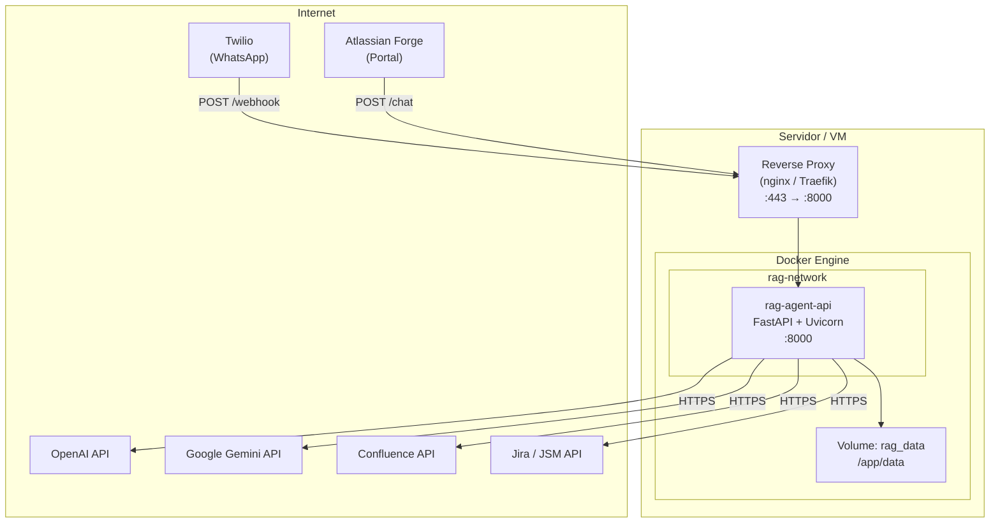

# Especificaciones de Infraestructura — Microservicio Agente RAG

## 1. Resumen de la Aplicación

| Aspecto | Detalle |
|---|---|
| **Nombre** | RAG Agent Microservice |
| **Lenguaje** | Python 3.11 |
| **Framework** | FastAPI + Uvicorn |
| **Base de Datos Vectorial** | ChromaDB (almacenamiento en disco local) |
| **Integraciones externas** | OpenAI / Google Gemini, Confluence, Jira/JSM, Twilio |
| **Puerto** | `8000` (configurable) |
| **Healthcheck** | `GET /health` → `{"status": "ok"}` |

---

## 2. Archivos Docker Generados

Se generaron 3 archivos en la raíz del proyecto, listos para usar:

| Archivo | Propósito |
|---|---|
| [Dockerfile](file:///Users/juanibarra/Documents/Proyectos/Trabajo/sisorg/rag-agent-microservice/Dockerfile) | Imagen multi-stage optimizada (build + runtime) |
| [.dockerignore](file:///Users/juanibarra/Documents/Proyectos/Trabajo/sisorg/rag-agent-microservice/.dockerignore) | Excluye archivos innecesarios del contexto de build |
| [docker-compose.yml](file:///Users/juanibarra/Documents/Proyectos/Trabajo/sisorg/rag-agent-microservice/docker-compose.yml) | Orquestación con volúmenes, red y límites de recursos |

---

## 3. Especificaciones de Hardware Recomendadas

### Mínimas (para 1 instancia, carga baja)

| Recurso | Valor |
|---|---|
| **CPU** | 2 vCPU |
| **RAM** | 2 GB |
| **Disco** | 10 GB SSD (SO + app + ChromaDB) |
| **Red** | Acceso HTTPS saliente a APIs externas |

### Recomendadas (producción, carga moderada)

| Recurso | Valor |
|---|---|
| **CPU** | 4 vCPU |
| **RAM** | 4 GB |
| **Disco** | 20 GB SSD |
| **Red** | Acceso HTTPS saliente + IP/dominio fijo para webhook de Twilio |

> [!NOTE]
> ChromaDB en modo local (embebido) no requiere un servidor de base de datos separado. Los datos se persisten en un volumen Docker montado en `/app/data`. Si la base de conocimiento en Confluence crece significativamente (>10,000 páginas), considerar migrar a una solución vectorial gestionada (Pinecone, Weaviate).

---

## 4. Requisitos de Red y Conectividad

La aplicación necesita acceso **saliente** a las siguientes APIs externas:

| Servicio | Endpoint | Puerto |
|---|---|---|
| OpenAI API | `api.openai.com` | 443 (HTTPS) |
| Google Gemini API | `generativelanguage.googleapis.com` | 443 (HTTPS) |
| Confluence | `*.atlassian.net` | 443 (HTTPS) |
| Jira / JSM | `*.atlassian.net`, `auth.atlassian.com` | 443 (HTTPS) |
| Twilio (OAuth) | `api.twilio.com` | 443 (HTTPS) |

Y acceso **entrante** en:

| Flujo | Puerto | Origen |
|---|---|---|
| API REST (Forge / Chat) | 8000 (o el mapeado) | Atlassian Forge / Frontend |
| Webhook WhatsApp (Twilio) | 8000 (o el mapeado) | Servidores de Twilio |

> [!IMPORTANT]
> Para el webhook de Twilio es necesario que el servicio sea accesible públicamente (o a través de un reverse proxy / load balancer con dominio y certificado SSL). Twilio envía `POST` al endpoint configurado y valida la respuesta.

---

## 5. Variables de Entorno Requeridas

Todas las variables se definen en el archivo `.env` en la raíz del proyecto. El contenedor las carga automáticamente vía `env_file` en Docker Compose.

```bash
# LLM
OPENAI_API_KEY=sk-...
GOOGLE_API_KEY=AIza...
LLM_PROVIDER=gemini          # openai | gemini

# Confluence
CONFLUENCE_URL=https://tu-dominio.atlassian.net/wiki
CONFLUENCE_USERNAME=email@ejemplo.com
CONFLUENCE_API_TOKEN=ATATT...

# Jira
JIRA_URL=https://tu-dominio.atlassian.net
JIRA_USERNAME=tu-email@dominio.com
JIRA_API_TOKEN=tu-api-token
JIRA_ALLOWED_PROJECTS=["PROJ","SOP"]

# Jira Service Management (OAuth 2.0)
JSM_CLOUD_ID=tu-cloud-id
JSM_CLIENT_ID=tu-oauth-client-id
JSM_CLIENT_SECRET=tu-oauth-client-secret
JSM_INITIAL_REFRESH_TOKEN=tu-refresh-token

# Seguridad
API_KEY=clave-secreta-para-forge
TWILIO_AUTH_TOKEN=tu-twilio-auth-token
```

> [!CAUTION]
> El archivo `.env` contiene secretos sensibles. **Nunca** debe incluirse en la imagen Docker ni en el repositorio. El `.dockerignore` ya lo excluye. En entornos productivos, considerar un gestor de secretos (AWS Secrets Manager, HashiCorp Vault, Docker Secrets).

---

## 6. Volúmenes Persistentes

| Volumen Docker | Mount point en container | Contenido |
|---|---|---|
| `rag_data` | `/app/data` | Base vectorial ChromaDB (`/chroma`) y tokens OAuth JSM (`jsm_tokens.json`) |

> [!WARNING]
> **Backup obligatorio**: El volumen `rag_data` contiene la base de conocimiento indexada. Si se pierde, se deberá re-ejecutar la ingesta desde Confluence. Se recomienda programar backups periódicos del volumen.

---

## 7. Comandos de Despliegue

### Build y arranque

```bash
# Construir la imagen y levantar el servicio
docker compose up -d --build

# Verificar el estado
docker compose ps

# Ver logs en tiempo real
docker compose logs -f rag-agent
```

### Verificación de salud

```bash
# Healthcheck rápido
curl http://localhost:8000/health
# Respuesta esperada: {"status":"ok"}
```

### Detener y limpiar

```bash
# Detener sin eliminar volúmenes
docker compose down

# Detener y eliminar volúmenes (⚠️ borra datos de ChromaDB)
docker compose down -v
```

### Re-Ingesta de la base de conocimiento

```bash
# Disparar ingesta de Confluence tras el primer deploy
curl -X POST http://localhost:8000/api/v1/ingest \
  -H "X-API-KEY: tu-api-key"
```

---

## 8. Arquitectura de Despliegue



---

## 9. Recomendaciones Adicionales para Producción

| Área | Recomendación |
|---|---|
| **Reverse Proxy** | Usar Nginx o Traefik delante del contenedor para TLS termination y rate limiting |
| **SSL/TLS** | Certificado válido obligatorio (Let's Encrypt gratuito vía Certbot o Traefik) |
| **Monitoreo** | Integrar con Prometheus + Grafana o equivalente del cloud provider |
| **Logging centralizado** | Considerar enviar logs a ELK Stack, Datadog o CloudWatch |
| **CI/CD** | Pipeline para build automático de imagen en cada push a `main` |
| **Escalado** | Si se necesitan múltiples instancias, migrar ChromaDB a un servicio externo para evitar conflictos de escritura |
| **Backups** | Cron job para backup del volumen `rag_data` (mínimo diario) |
| **Secrets** | Migrar de `.env` a un gestor de secretos en producción |

---

## 10. Equivalencias en Cloud Providers

Si se prefiere un servicio en la nube en lugar de una VM:

| Provider | Servicio recomendado | Notas |
|---|---|---|
| **AWS** | ECS Fargate (serverless) o EC2 `t3.medium` | Fargate simplifica la gestión; EC2 da más control |
| **Azure** | Azure Container Instances o App Service | ACI para simplicidad, App Service para más features |
| **GCP** | Cloud Run (serverless) o Compute Engine `e2-medium` | Cloud Run ideal si la carga es intermitente |
| **DigitalOcean** | App Platform o Droplet 4GB | Opción económica y sencilla |

> [!TIP]
> Para cargas intermitentes (como un agente de soporte que no recibe tráfico 24/7), los servicios serverless como **AWS Fargate** o **Google Cloud Run** son los más costo-eficientes, ya que cobran solo por uso.
